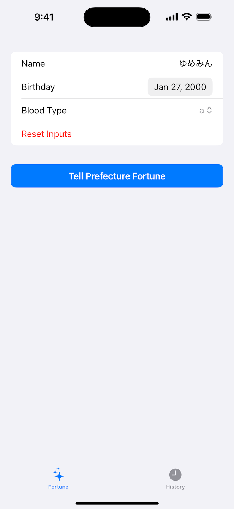
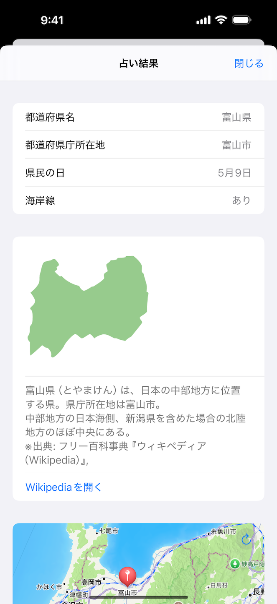
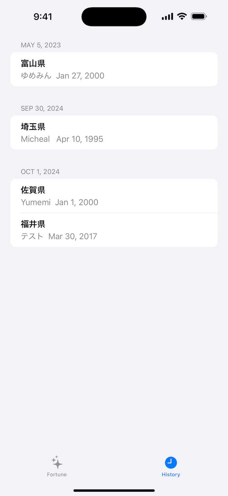
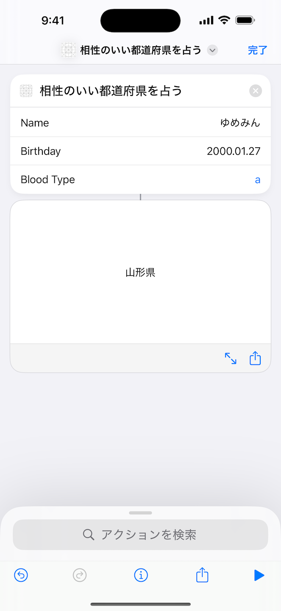

# 相性のいい都道府県を占いい
## アプリ仕様
「あなたと相性のいい都道府県を占ってあげる！」をテーマに iPhone アプリを作ってください。API 仕様下記の通りです。
## 利用技術
- SwiftUI
- MapKit
- NaturalLanguage（未完成）
- SwiftData
- App Intents

## 機能
| 占い | 占い結果 | 履歴 | 自動化 |
|-----------------|-----------------|-----------------|-----------------|
| 名前・誕生日・血液型を入力し相性のいい都道府県を占う | 占った都道府県の詳細を表示 | 過去の占い結果を日付別に一覧表示 | ショートカットを利用しアプリ外でも占い |
|  |  |  |  |

### iPad対応
| サイドバー | タブバー |
|-----------------|-----------------|
| 画面サイズを活用し履歴をサイドバーに表示 | iPhone同様のタブを画面上部に表示 |
|  |  |
## 環境
- macOS 15
- Xcode 16.0 (16A242d)
## 参考文献
- https://ios-junior-engineer-codecheck.yumemi.jp/
- https://qiita.com/higan96/items/36d3877a85ab8fc36ea7
- https://developer.apple.com/library/archive/featuredarticles/iPhoneURLScheme_Reference/MapLinks/MapLinks.html
- https://qiita.com/ya_s_u/items/2a6364040f9b184a9679
- https://qiita.com/mashunzhe/items/28c06eafc024954e4256
- https://useyourloaf.com/blog/mapkit-for-swiftui/
